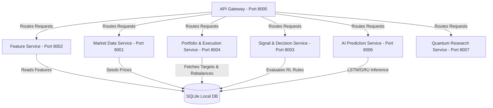

# 🚀 QuantX: AI-Powered Quantitative Investment & Portfolio Orchestration Platform

QuantX is a production-grade, microservice-based quantitative trading, backtesting, and portfolio optimization platform. It combines deep learning forecasting models, reinforcement learning decision engines, real-world data ingestion pipelines, and a high-fidelity, real-time React/Next.js dashboard built with dark-mode glassmorphism aesthetics.

---

## 🏗️ System Architecture & Microservices

QuantX is engineered with a modular, resilient microservices architecture communicating via a central API Gateway:



---

## ✨ Key Features

1. **AI Predictions & Inference Engines**:
   - Deep learning forecasting models (LSTM, GRU, Transformers) for stock prices.
   - Reinforcement learning (PPO) agents executing real-time buy/sell/hold decisions.
2. **Real-world Database Ingestion**:
   - Seeded with 49 Indian stock histories (Nifty 50) and 10 US stock histories (NASDAQ) spanning 1999–2026.
3. **High-Performance Backtesting Lab**:
   - Code-editor interface executing backtests with live metric charting (Sharpe, Drawdown, Profitability).
4. **Automated Portfolio Optimization**:
   - Markowitz mean-variance optimization and automatic asset rebalancing console.
5. **Real-time UI Over WebSockets**:
   - Real-time ticker price feeds, system alerts, and notification drawer.

---

## 🛠️ Tech Stack

* **Frontend**: Next.js 14, React 18, Recharts, Lucide Icons, TailwindCSS.
* **Backend Services**: Python (FastAPI, Uvicorn, SQLAlchemy).
* **AI & Machine Learning**: PyTorch, Stable Baselines 3 (RL), Pandas, NumPy.
* **Database & Persistence**: SQLite (local development / offline mode), PostgreSQL (production-ready schemas).

---

## 🚀 Getting Started

### Prerequisites
* Python 3.9+
* Node.js 18+

### 1. Backend Installation & Database Setup
Initialize a virtual environment and install backend dependencies:
```bash
# Create and activate virtual environment
python -m venv .venv
.venv\Scripts\activate     # On Windows
source .venv/bin/activate  # On macOS/Linux

# Install dependencies
pip install -r requirements.txt

# Seed the database with real-world Nasdaq & Nifty 50 datasets
python backend/populate_db.py
```

### 2. Frontend Setup
Install frontend node dependencies:
```bash
cd frontend/dashboard
npm install
npm run build   # Compile production package
```

### 3. Launching Services
You can run all services with a single startup script:
```bash
# From the root directory:
python start_services.py
```
This automatically starts the API Gateway, Market Data, Feature, Portfolio, Signal, AI Prediction, and Next.js web application servers. Open **`http://localhost:3000`** in your browser to interact with the platform!

---

## 🧪 Running Tests
QuantX includes an extensive suite of unit and system tests ensuring service reliability:
```bash
# Run unit tests
pytest tests/

# Run system endpoints checks
powershell -File tests/test_endpoints.ps1
```

---

## 📊 Endpoints Cheat-Sheet

| Service | Port | Endpoint | Description |
| :--- | :--- | :--- | :--- |
| **API Gateway** | `8005` | `GET /api/health` | Service status aggregator |
| **API Gateway** | `8005` | `GET /api/portfolio` | Fetch active holdings & positions |
| **API Gateway** | `8005` | `POST /api/backtest` | Trigger custom strategy backtests |
| **Market Data** | `8001` | `GET /assets` | List registered stock assets |
| **AI Prediction**| `8006` | `GET /predict/{symbol}` | Get price forecasting scores |
