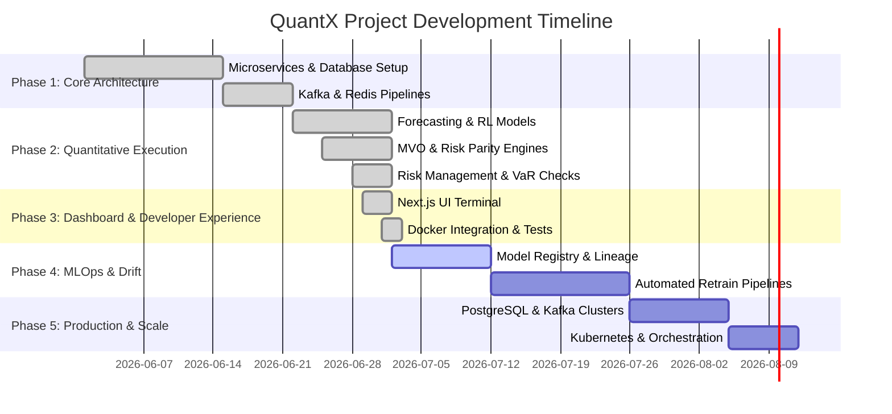

# QuantX Project Roadmap

This document outlines the current completion status and future development milestones for the QuantX Quantitative Trading and Portfolio Optimization System.

---

## 🗺️ High-Level Development Status

---

## ✅ Completed Tasks

### Phase 1: Core Service Architecture & Messaging
- **Multi-Service Framework:** Created modular service boundaries for `api-gateway`, `market-data-service`, `feature-service`, `signal-service`, and `portfolio-service`.
- **Event Streaming:** Established Kafka topics (`market.raw.ohlcv`, `market.features`, `market.signals`, and `portfolio.trades`) for real-time async communication.
- **Feature Store:** Set up Redis caches to serve as a low-latency feature store.
- **Database Schema:** Designed a robust schema supporting portfolios, positions, trades, prices, technical features, predictions, and historical risk metrics.

### Phase 2: Quantitative Trading & Risk Management
- **Statistical Forecasting:** Implemented PyTorch models including **LSTM**, **GRU**, and **Transformer** sequence forecasters with temporal splits.
- **Reinforcement Learning:** Configured a Gymnasium-compatible `TradingEnvironment` supporting PPO, DQN, and A2C training via `stable-baselines3`.
- **Portfolio Optimization:** Built mathematical models for **Mean-Variance Optimization (MVO)**, **Risk Parity (Marlim)**, and **Black-Litterman** portfolio rebalancing.
- **Risk Shielding:** Created a `RiskManager` module to compute portfolio-wide **95% VaR / CVaR** and reject trades exceeding exposure/leverage limits.
- **Backtest Simulator:** Developed an event-driven backtesting engine to simulate historical strategy performance, CAGR, Sharpe/Sortino ratios, and drawdowns.

### Phase 3: Dashboard Terminal & Developer Experience
- **Next.js Web Console:** Created a responsive financial terminal displaying real-time price tick charts, signal feeds, active holdings, and optimization simulations.
- **Bug Fixes:**
  - Resolved Next.js compile errors caused by a syntax mismatch in `handleRunBacktest`.
  - Integrated `portfolio-service` into `docker-compose.yml` to resolve internal container routing failures.
- **DB Populator:** Built and ran `populate_db.py` to seed SQLite fallbacks with mock assets, 120-day historical prices, active trades, and positions.
- **Developer Guide:** Completed `local_dev_guide.md` specifying step-by-step instructions for launching services in offline SQLite mode.
- **Testing:** Wrote unit tests for risk management, rebalancing, indicators, and feature drift, achieving **100% passing tests (27/27)**.

---

## 📋 Remaining & Future Tasks

### Phase 4: MLOps Pipelines & Model Drift (Target: Q3 2026)
- [x] **Model Registry Setup:** Deploy MLflow or a similar registry to track model metrics, hyperparameter training runs, and version binary model weights.
- [x] **Automated Retraining Orchestrator:** Implement Airflow/Composer DAGs to trigger model retraining automatically when data drift is detected.
- [x] **Real-time Drift Alerter:** Enhance the feature-monitor service to send Slack/PagerDuty webhooks when feature values diverge significantly from baseline z-scores.

### Phase 5: Production Deployment & Scale Hardening (Target: Q4 2026)
- [x] **PostgreSQL Migration:** Migrate from SQLite to PostgreSQL for production execution using the compiled `schema.sql`.
- [x] **Kubernetes Orchestration:** Write Helm charts and deployment manifests to deploy microservices on Google Kubernetes Engine (GKE) or AWS EKS.
- [x] **Service Mesh & Security:** Configure Istio or Linkerd to handle TLS encryption, mTLS between services, and request rate limiting.
- [x] **Monitoring & Alerting Dashboards:** Finalize Prometheus metric scraping endpoints and build detailed Grafana templates to monitor service health, memory usage, and API latency.

### Phase 6: Live Trading & Broker Integrations (Target: Q1 2027)
- [x] **Alpaca Live Account Integration:** Complete integration tests for live account endpoints, including support for real-time WebSocket stream connections for order updates.
- [x] **Options and Forex Support:** Expand the `market-data-service` to parse Options chains and Forex feeds.
- [x] **Distributed Backtesting:** Utilize **Ray** or **Celery** tasks to parallelize backtests across multiple CPU cores for faster hyperparameter sweeps.

---

> [!TIP]
> To launch the application locally in offline/SQLite fallback mode, run `populate_db.py` and then refer to the startup instructions in [local_dev_guide.md](file:///c:/KrSanib/Resume%20Projects/QuantX/local_dev_guide.md).
